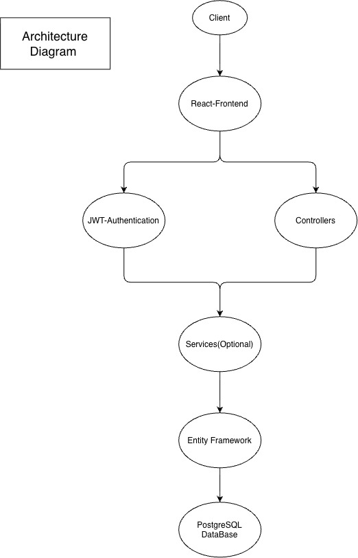
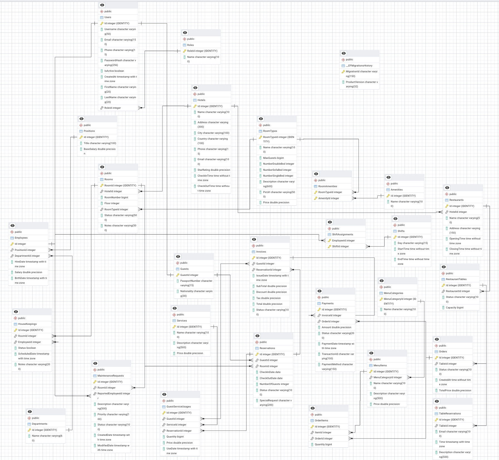
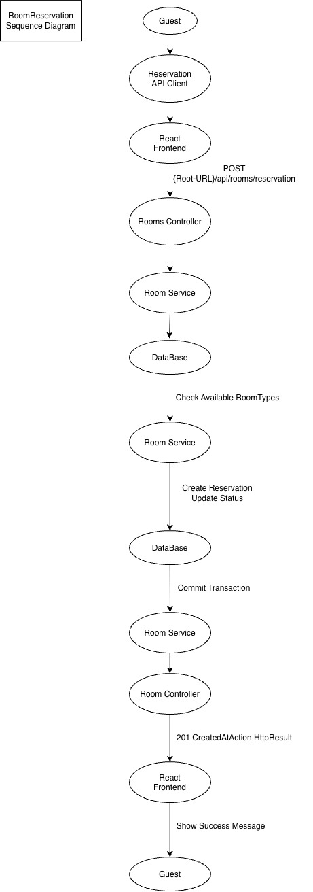
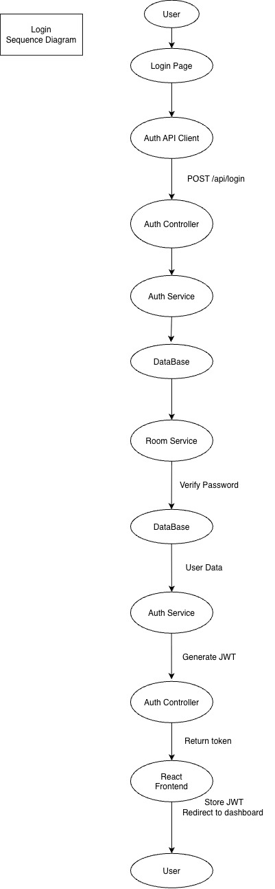

# 🏨 Hotel Management System

A comprehensive Hotel Management backend built with **ASP.NET Core 9**, **Entity Framework Core**, and **PostgreSQL**, and **React**.

This WebAPI project provides a complete RESTful API for managing hotels, reservations, guests, employees, restaurants, payments, housekeeping, and maintenance. It is designed using a layered architecture that separates business logic from data access while providing a scalable and maintainable codebase.

The backend is consumed by a React frontend and communicates through REST APIs secured with JWT Authentication.

---

# Table of Contents

- [Project Overview](#project-overview)
- [Project Description](#project-description)
- [Features](#features)
- [Authentication & Authorization](#authentication--authorization)
- [Hotel Management](#hotel-management)
- [Reservation Management](#reservation-management)
- [Guest Management](#guest-management)
- [Restaurant Management](#restaurant-management)
- [Payment & Invoice Management](#payment--invoice-management)
- [Employee Management](#employee-management)
- [Housekeeping Management](#housekeeping-management)
- [Maintenance Requests](#maintenance-requests)
- [Architecture](#architecture)
- [System Design](#system-design)
- [XunitTests](#xunit-tests)
- [Frontend](#frontend)

---

# Project Overview

The Hotel Management System is a modular backend application designed to automate and simplify hotel operations.

Instead of focusing only on room reservations, the system covers nearly every department inside a hotel, allowing them to communicate through a centralized backend.

The API exposes endpoints for managing hotels, rooms, guests, reservations, payments, employees, restaurants, and maintenance operations.

The project was developed following clean architectural principles, making it easy to extend, maintain, and integrate with different frontend technologies.

---

# Project Description

The backend is developed using **ASP.NET Core 9** and follows a layered architecture where each responsibility is isolated into dedicated components.

Business logic is implemented inside service classes while controllers remain lightweight and responsible only for handling HTTP requests and responses.

Entity Framework Core is used as the ORM for interacting with PostgreSQL, providing strongly typed database access and Migration support and Configuration files to determine the exact behavior of the database.

Authentication is implemented using JSON Web Tokens (JWT), allowing authenticated users to securely access protected resources based on their assigned roles.

The backend exposes RESTful APIs consumed by a React frontend.

---

# Features

- [Authentication & Authorization](#authentication--authorization)
- [Configuration](#configuration)
- [Hotel Management](#hotel-management)
- [Reservation Management](#reservation-management)
- [Guest Management](#guest-management)
- [Restaurant Management](#restaurant-management)
- [Payment & Invoice Management](#payment--invoice-management)
- [Employee Management](#employee-management)
- [Housekeeping Management](#housekeeping-management)
- [Maintenance Requests](#maintenance-requests)

---

# Authentication & Authorization

The authentication module provides secure access to the system.

### Features

- User Login
- JWT Authentication
- Password Hashing
- Role-Based Authorization
- Protected Endpoints
- Secure Token Validation

---

# Configuration

This will make the DataBase have specific behavior that we expect from each entity

### Features

- Create PK
- Create FK
- Create On Delete behavior
- Create Constraints

---

# Hotel Management

This module manages hotels and their available rooms.

### Features

- Update Hotel Information
- Position Update & Creating
- Hotel Information
- Every Other Option

---

# Reservation Management

The reservation module is responsible for booking rooms and managing guest stays.

### Features

- Reserve Rooms
- Room Availability Validation
- Check-in
- Check-out
- Reservation Status
- Reservation History
- Transaction-Based Reservation Process
- Restaurant Menu
- Restaurant Reservation

---

# Guest Management

Handles guest information and booking history.

### Features

- Register Guests
- Guest Profiles
- Guest History
- Contact Information
- Reservation Lookup

---

# Restaurant Management

Manages hotel restaurants and customer orders.

### Features

- Menu Categories
- Menu Items
- Restaurant Orders
- Order Items
- Restaurant Payments

---

# Payment & Invoice Management

Responsible for financial operations inside the hotel.

### Features

- Payments
- Invoice Generation
- Reservation Payments
- Restaurant Payments
- Payment History

---

# Employee Management

Manages hotel staff and organizational information.

### Features

- Employee Information
- Departments
- Positions
- Employee Assignment

---

# Housekeeping Management

Tracks housekeeping operations for hotel rooms.

### Features

- Cleaning Status
- Assigned Employees
- Cleaning Schedule
- Completion Tracking

---

# Maintenance Requests

Allows hotel staff to report and manage maintenance tasks.

### Features

- Maintenance Requests
- Request Status
- Assigned Employee
- Completion Tracking

---

# Architecture

The project follows a layered architecture.

The system is divided into several independent layers:

- Controllers
- Services
- Entity Framework Core
- Configurations
- Migrations
- Seeding
- PostgreSQL

Each layer has a single responsibility and communicates only with adjacent layers.

---

# System Design

The project documentation includes several diagrams describing both the database and the overall system.

## Entity Relationship Diagram (ERD)

The ERD illustrates the relationships between the database entities used throughout the application.

---

## Reservation Sequence Diagram

The following sequence diagram illustrates the complete reservation workflow from the React frontend to the database transaction.

---

## Authentication Sequence Diagram

The authentication workflow demonstrates the login process, credential validation, JWT generation, and token delivery to the frontend.

---

# XunitTests

---

# Frontend

The frontend of this project is implemented as a separate React application.

It provides a modern and responsive user interface that communicates with this backend exclusively through REST APIs.

The frontend includes:

- Authentication
- Dashboard
- Hotel Management
- Reservation Management
- Guest Management
- Restaurant Management
- Employee Management
- Payment Management
- Reports

Repository:

https://github.com/yourusername/hotel-management-frontend
